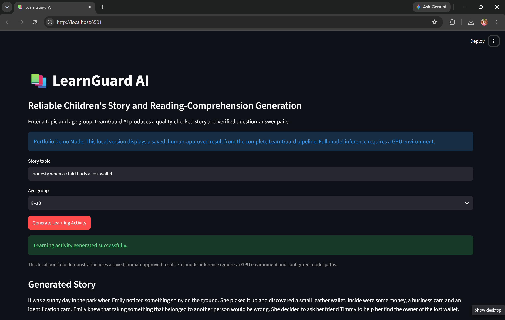
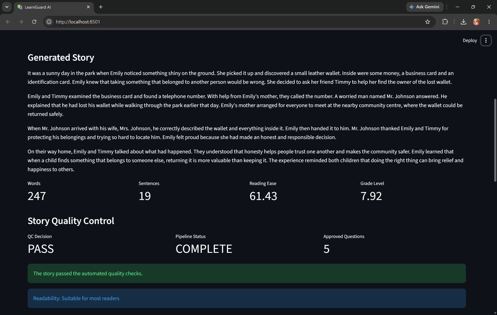
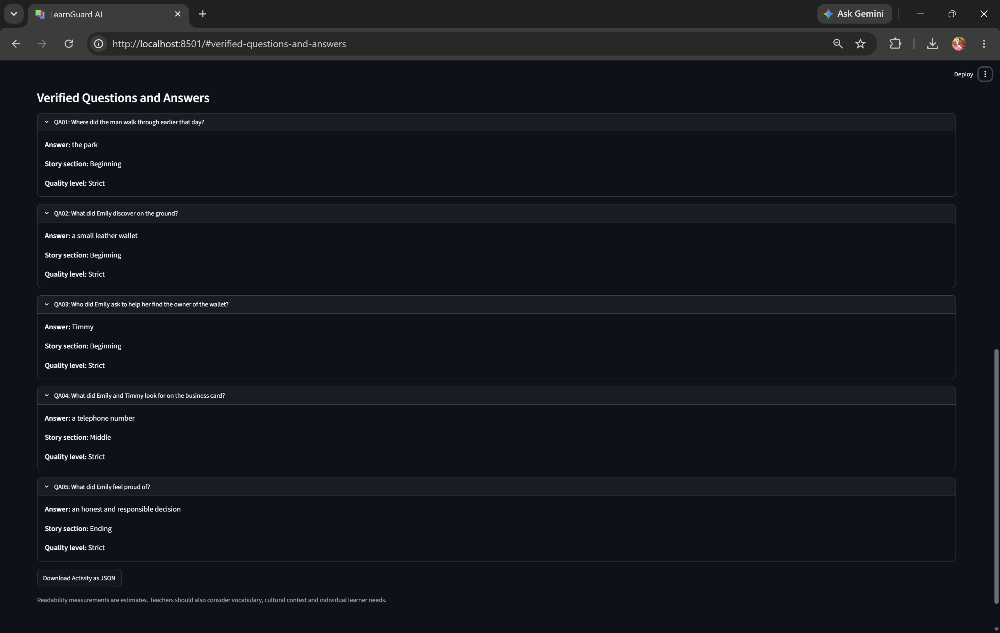

# LearnGuard AI

An NLP pipeline for generating children's stories and reliable reading-comprehension question–answer pairs, with automated quality control at every stage.

> **Status:** Working portfolio demo with a validated end-to-end example. GPU inference with the three fine-tuned models is the next integration phase.

## Why this project?

Generative models can create educational content quickly, but their outputs may contain inconsistent stories, unanswerable questions, duplicate questions, or answers that are not supported by the story.

LearnGuard AI addresses this problem with a multi-stage pipeline that generates content, evaluates it, and rejects unreliable outputs before presenting them to a user.

## Pipeline

1. **Story generation and quality control** – generate an age-appropriate story and check its structure, topic preservation, length, ending, and character-name consistency.
2. **Answer-span ranking** – identify candidate answers, remove vague or duplicate spans, and balance selections across the beginning, middle, and ending.
3. **Question generation** – use an answer-aware fine-tuned T5 model to generate and rank question candidates.
4. **QA verification** – compare answers from a fine-tuned generative QA model and an independent extractive QA verifier, then apply strict quality gates.
5. **Human review** – retain a manual approval step for educational safety and narrative quality.

## Validated example

For the topic **“honesty when a child finds a lost wallet”** and age group **8–10**, the pipeline produced:

| Stage | Result |
|---|---:|
| Human-approved story | 247 words |
| Ranked answer spans | 12 |
| Question candidates | 17 |
| Answer spans covered by questions | 6 |
| Robustly approved candidates | 9 |
| Final unique strict QA pairs | 5 |

These figures describe one fully reviewed demonstration run; they are not presented as dataset-wide model-performance estimates.

## Portfolio demo

The Streamlit application provides:

- topic and age-group inputs;
- a saved, human-approved end-to-end result;
- readability statistics and story quality status;
- five verified question–answer pairs;
- downloadable JSON output.

The local app runs in transparent **demo mode** because the story-generation model is approximately 14.5 GB and requires a suitable GPU environment. Entering a different topic in demo mode does not run the large models locally.

### Application overview



### Generated story and quality-control results



### Verified question-answer pairs



## Application modes

LearnGuard supports two separate configurations.

| Feature | Demo mode | Full GPU mode |
| --- | --- | --- |
| Purpose | Lightweight portfolio demonstration | Complete end-to-end model inference |
| Story source | Saved, human-approved example | Fine-tuned story-generation model |
| Question source | Saved, verified QA pairs | Fine-tuned question-generation model |
| Answer verification | Previously validated results | Generative QA model and extractive verifier |
| Topic input | Displayed for interface demonstration | Used to generate a new story |
| Model files required | No | Yes |
| GPU required | No | Yes |
| Suitable for this Surface Pro | Yes | No; use Colab or another GPU environment |

### Demo mode

Demo mode allows reviewers to run the Streamlit interface without downloading the large model checkpoints. It displays one saved, human-approved result produced by the complete LearnGuard pipeline.

Changing the topic in demo mode does not generate new content. This limitation is shown clearly in the application.

Run demo mode with:

```powershell
$env:LEARNGUARD_MODE = "demo"
python -m streamlit run app/app.py
```

### Full GPU mode

Full GPU mode is designed to generate a new learning activity from the topic and age group entered by the user. It requires the three fine-tuned model checkpoints and a suitable CUDA GPU environment.

Required environment variables:

```text
LEARNGUARD_MODE=gpu
LEARNGUARD_STORY_MODEL_PATH=<path-to-story-model>
LEARNGUARD_QUESTION_MODEL_PATH=<path-to-question-generation-model>
LEARNGUARD_ANSWER_MODEL_PATH=<path-to-question-answering-model>

#### Example Google Colab configuration

Mount Google Drive first:

```python
from google.colab import drive

drive.mount("/content/drive")
```

Configure LearnGuard AI:

```python
import os

os.environ["LEARNGUARD_MODE"] = "gpu"

os.environ["LEARNGUARD_STORY_MODEL_PATH"] = (
    "/content/drive/MyDrive/KidStory-Qwen2.5/final_model_merged"
)

os.environ["LEARNGUARD_QUESTION_MODEL_PATH"] = (
    "/content/drive/MyDrive/QA_Fairytale/QG_Phase3/"
    "t5base_QG_answeraware_e20_bs64_beam8/checkpoint-2000_final"
)

os.environ["LEARNGUARD_ANSWER_MODEL_PATH"] = (
    "/content/drive/MyDrive/QA_Fairytale/QA_Genera_New/"
    "t5base_fairytaleQA_tagged_e20_bs64_beam8/"
    "checkpoint-1250_polish/checkpoint-400_final"
)
```

> **Current implementation status:** Demo mode is fully runnable locally.  
> The validated model pipeline is documented in the notebooks. Direct full-GPU
> inference from the Streamlit interface is the next integration milestone.

## Models

The full experimental pipeline uses three models trained for this project:

| Component | Model |
|---|---|
| Story generation | Fine-tuned Qwen2.5 |
| Question generation | Fine-tuned T5-base, answer-aware |
| Generative question answering | Fine-tuned T5-base |
| Independent QA verification | `deepset/roberta-base-squad2` |

Model checkpoints are intentionally excluded from Git because they are large. The notebooks use configurable paths to checkpoints stored in Google Drive.

## Repository structure

```text
learnguard-ai/
├── app/
│   └── app.py
├── notebooks/
│   ├── 01_story_generation_and_quality_control.ipynb
│   ├── 02_answer_span_ranking.ipynb
│   ├── 03_question_generation.ipynb
│   └── 04_qa_verification.ipynb
├── src/
│   ├── config.py
│   ├── pipeline.py
│   ├── qa_verification.py
│   ├── question_generation.py
│   ├── readability.py
│   ├── span_ranking.py
│   └── story_quality.py
├── tests/
│   └── test_readability.py
├── .gitignore
├── README.md
└── requirements.txt
```

## Run locally

### 1. Clone the repository

```bash
git clone https://github.com/Rinosa123/learnguard-ai.git
cd learnguard-ai
```

### 2. Create and activate a virtual environment

Windows PowerShell:

```powershell
python -m venv .venv
Set-ExecutionPolicy -Scope Process -ExecutionPolicy RemoteSigned
.\.venv\Scripts\Activate.ps1
```

macOS or Linux:

```bash
python -m venv .venv
source .venv/bin/activate
```

### 3. Install dependencies

```bash
python -m pip install -r requirements.txt
```

### 4. Run the portfolio demo

```bash
python -m streamlit run app/app.py
```

### 5. Run the tests

```bash
python -m pytest -q
```

Current local test result: **9 passed**.

## GPU configuration

The modular code supports configuration through environment variables:

```text
LEARNGUARD_MODE=gpu
LEARNGUARD_STORY_MODEL_PATH=<story-model-directory>
LEARNGUARD_QUESTION_MODEL_PATH=<question-generation-model-directory>
LEARNGUARD_ANSWER_MODEL_PATH=<question-answering-model-directory>
```

The GPU model-loading adapter is not yet connected to the Streamlit application. Until that integration is completed, use the notebooks for full model inference and the application for the reproducible portfolio demonstration.

## Technology

- Python
- PyTorch
- Hugging Face Transformers
- Streamlit
- spaCy
- textstat
- pandas
- pytest
- Google Colab with NVIDIA GPU

## Current limitations

- Full inference requires GPU resources and locally configured checkpoints.
- The app currently demonstrates one saved, human-approved pipeline result.
- Automated quality gates reduce errors but do not replace teacher or expert review.
- The reported example results should be expanded into a multi-topic evaluation set.

## Next steps

- connect the three fine-tuned models to the modular GPU pipeline;
- add a small, versioned evaluation dataset and aggregate metrics;
- add tests for story QC, span ranking, question generation, and QA verification;
- deploy the lightweight demonstration app;
- add continuous integration with GitHub Actions.

## Responsible use

LearnGuard AI is a research and portfolio project. Generated educational material should be reviewed by a teacher or qualified adult before use with learners.
